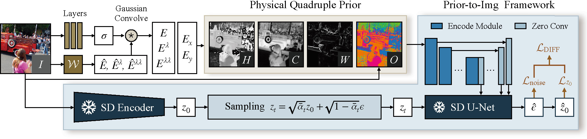

# Zero-Reference Low-Light Enhancement via Physical Quadruple Priors (CVPR-24)

This is the official PyTorch code for our paper Zero-Reference Low-Light Enhancement via Physical Quadruple Priors

[](https://arxiv.org/abs/2403.12933)
[](https://daooshee.github.io/QuadPrior-Website/)

Authors: [Wenjing Wang](https://daooshee.github.io/website/), [Huan Yang](https://hyang0511.github.io/), [Jianlong Fu](https://www.microsoft.com/en-us/research/people/jianf/), [Jiaying Liu](http://www.wict.pku.edu.cn/struct/people/liujiaying.html)



Keywords: train solely using normal light images, illumination-invariant prior, generative diffusion models

> In this paper, we propose a new zero-reference low-light enhancement framework trainable solely with normal light images. To accomplish this, we devise an illumination-invariant prior inspired by the theory of physical light transfer. This prior serves as the bridge between normal and low-light images. Then, we develop a prior-to-image framework trained without low-light data. During testing, this framework is able to restore our illumination-invariant prior back to images, automatically achieving low-light enhancement. Within this framework, we leverage a pretrained generative diffusion model for model ability, introduce a bypass decoder to handle detail distortion, as well as offer a lightweight version for practicality.

#### 0. Preparation

Create a new conda environment
```
conda env create -f environment.yaml
conda activate quadprior
```
You may refer to https://pytorch.org/get-started/previous-versions/ for more information about installing old pytorch (1.12.1) versions. Some of the common environment configuration problems and solutions can be found in [Issues](https://github.com/daooshee/QuadPrior/issues?q=).

Download the checkpoints from [Google Drive](https://drive.google.com/drive/folders/1NbqfOJYjv-_zH1NzTaaLmZDKjYA9clbd?usp=drive_link) or [Baidu Netdisk](https://pan.baidu.com/s/10sKrFyCHBQCVk76Y33wJlw?pwd=j9kv) and replace the empty files as follows (required for both training and testing)

- `./checkpoints/COCO-final.ckpt`
- `./checkpoints/main-epoch=00-step=7000.ckpt`
- `./models/control_sd15_ini.ckpt`

#### 1. Test

For testing the example images in `./test_data`, simply run:

```
CUDA_VISIBLE_DEVICES=0 python test.py --input_folder ./test_data --same_folder ./output_QuadPrior
```

Then the resulting images can be found in `./output_QuadPrior`.

Expected results can be found in `./output_QuadPrior-reference` for reference.

By default, the inference code uses float16. On NVIDIA GeForce RTX 4090, the inference requires about 13GB of GPU memory.

> Ready-made results on LOL-v1, LOL-v2 (real), MIT Adobe FiveK, DICM, LIME, MEF, NPE, and VV datasets can be downloaded from [Google Drive](https://drive.google.com/drive/folders/1NbqfOJYjv-_zH1NzTaaLmZDKjYA9clbd?usp=drive_link) or [Baidu Netdisk](https://pan.baidu.com/s/10sKrFyCHBQCVk76Y33wJlw?pwd=j9kv).

About metrics, we use BRISQUE from [IQA-PyTorch](https://github.com/chaofengc/IQA-PyTorch) and NL from [noise_est_ICCV2015](https://github.com/zsyOAOA/noise_est_ICCV2015). PSNR, SSIM, LPIPS, and LOE can be found in `./paired-metrics.py`.

#### 2. Train

##### 2.1 Data Preparation
Our model is trained solely with the [COCO dataset](https://cocodataset.org/).

In `train.py`, write the path to COCO images as `coco_images`, following the format of [glob.glob](https://docs.python.org/3/library/glob.html).

For example, you may download the train and unlabeled sets and save them as `./COCO-2017/train2017/` and `./COCO-2017/unlabeled2017/`

##### 2.2 Train
Other parameters can be edited in `train.py`, such as batch size (`batch_size`), number of GPUs (`number_of_gpu`), learning rate (`learning_rate`), how frequently to save visualization (`logger_freq`).

By default, the training uses float16 and deepspeed stage 2, offload optimizer, and CPU checkpointing.

On NVIDIA GeForce RTX 4090, setting 4 batches per GPU takes 20GB memory for each GPU. We use 2 GPUs to train the framework.

If you want to train from scratch, please set `resume_path=''`. Currently it continues training from `checkpoints/COCO-final.ckpt`.

For evaluating the trained checkpoint, you might need to adjust the code for loading the checkpoint. Please refer to this [issue](https://github.com/daooshee/QuadPrior/issues/2) for more details.

-------

If you have any questions, you can submit an Issue or contact daooshee at pku.edu.cn

If you find our code useful, please consider citing our paper.

```
@misc{quadprior,
  title={Zero-Reference Low-Light Enhancement via Physical Quadruple Priors}, 
  author={Wenjing Wang and Huan Yang and Jianlong Fu and Jiaying Liu},
  booktitle={IEEE conference on computer vision and pattern recognition (CVPR)}
  year={2024},
}
```

-------

This code is based on [ControlNet](https://github.com/lllyasviel/ControlNet) 
